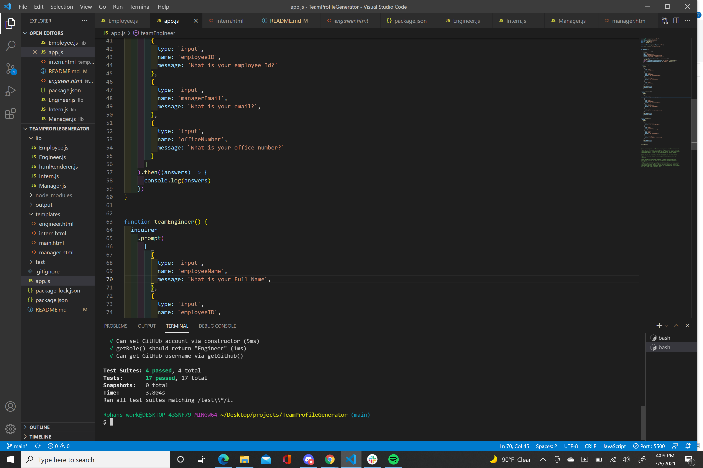
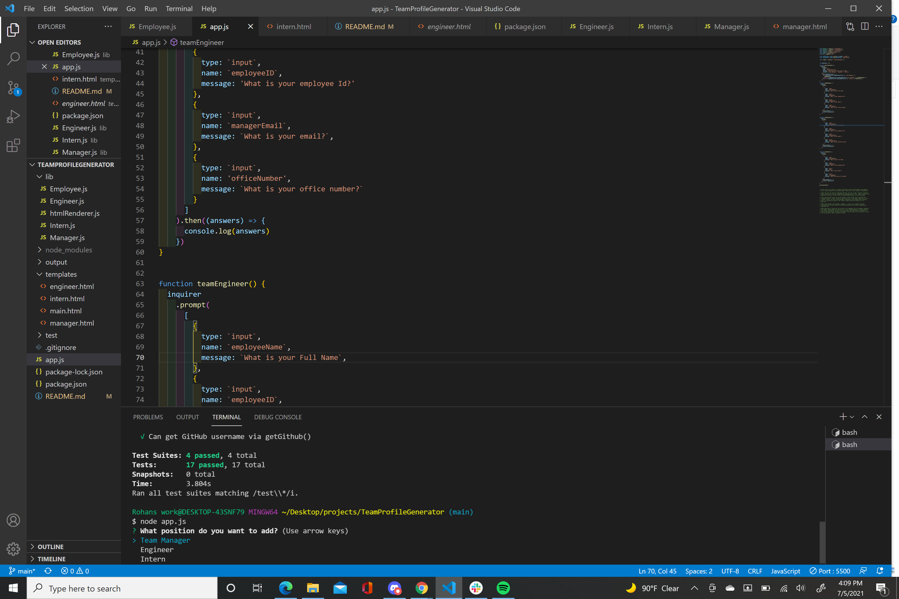
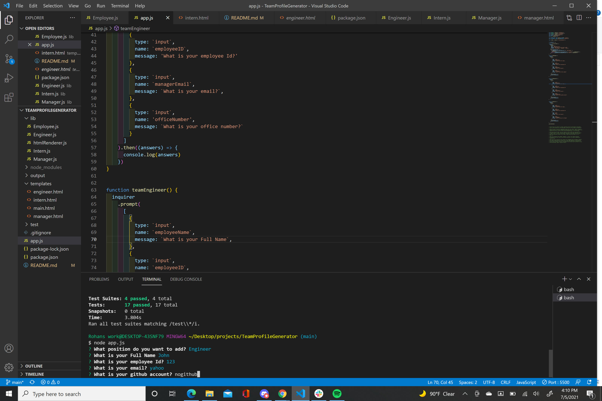
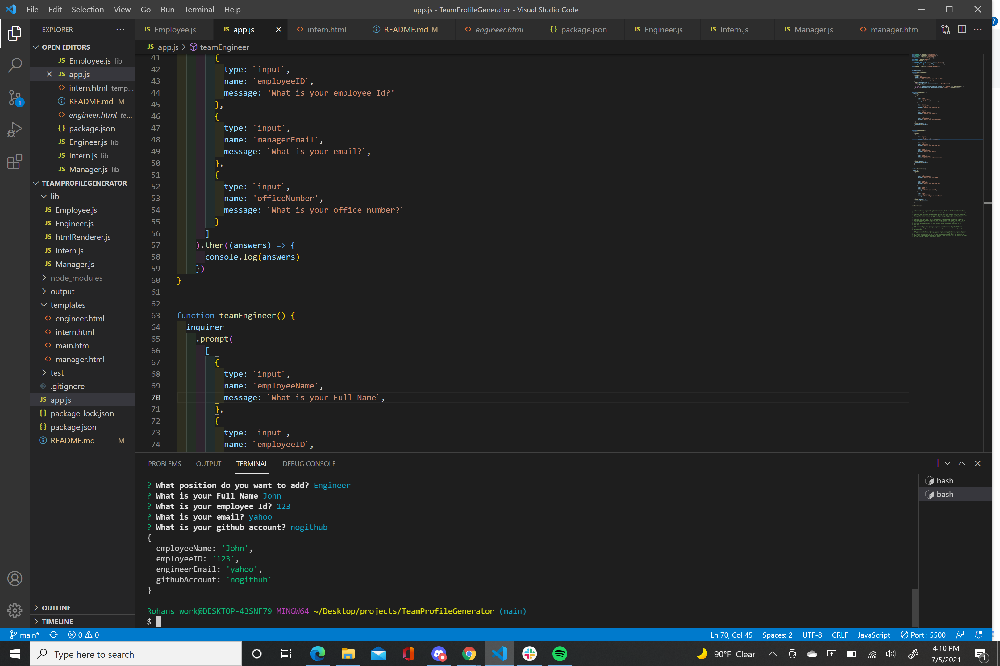
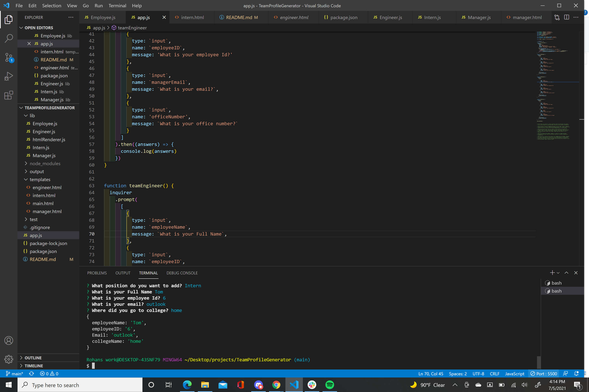
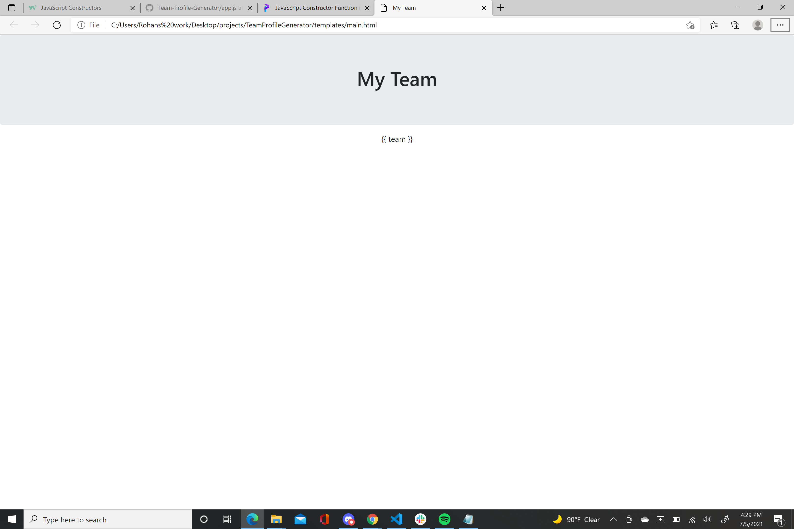

# TeamProfileGenerator
 Our task was to use a Node.js command line app that takes information about a software team and renders a html page with individual user profiles. The members of the team had different roles(Manager,Intern,Engineer) and each role had some slight differences in regards to the information of their specific profile. 

 Success-
   Successfully made questions for each role that had slight differences that were specific to the position within the company
   Tests passed
   Was able to use node add.js to ask questions in the terminal
   The questions rendered within the terminal depended varied based on what position you selected

Needs Improvement-
Still need to successfully render completed HTML with individual profiles.

Also included in the page are screenshots of the tests that were run and some of the questions in the terminal for the various positions. I also included a screenshot of an incomplete html page

